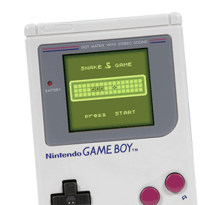

# GB Snake 

GB Snake is project coded in c that implements the Snake game for the Gameboy 1st generation (black and white screen).



## Supported platforms

GB Snake was primarily developed on MacOS (10.15) but was also built and tested on Linux (Centos 7).

## Dependencies

Required:
* Makefile
* gcc compiler
  
Optional:
* Python 3
* Pillow

## Getting Started

1. Make sure gcc and make are installed

```bash
> gcc --version
> make --version
```
If some version and info are printed after running the previous commands, gcc and make are installed. If you get `command not found` error, please be sure to install them first.

2. Download GBDK-2020 latest release

Go to the [GBDK-2020 release page](https://github.com/gbdk-2020/gbdk-2020/releases) and download the last release available for your platform and extract the content to a given folder.

3. Clone the GBSnake project

```bash
> git clone https://github.com/raph080/gbSnake
```

4. Build  

Enter the cloned folder and run the Makefile by specifying the folder containing the last GBDK-2020 release previously downloaded and extracted.
```bash
> cd gbSnake
> make GBDK_LOCATION=/path/to/GBDK-2020-release
```

5. Run
   
If everything went well, a `bin` folder is created with `snake.gb` inside.
You can then run the game with your favourite emulator.

## Gameboy emulators

Various emulators exist (see https://www.emulator-zone.com/doc.php/gameboy/).

The one that was used to developed GB Snake on MacOS was [Emulicious](https://emulicious.net). This software is really convenient due to its debug features and its support on a lot of operating system. 

If you wish to quickly test the game without installing any emulator on your machine, I then suggest using https://taisel.github.io/GameBoy-Online/

## vendors
### gbt player

[GBT Player](https://github.com/AntonioND/gbt-player) is used to convert mod music to GBT code files thanks to the `mod2gbt` binary. It also provides a library to ease the sound management from GBT code files.

The code from GBT player has been copied from its original repository and restructured within the vendors folder.

## scripts
### image2gbpng.py

Python 3 and Pillow are required to run this script.

`image2gbpng.py` converts an image to another one that is compatible with the
gameboy architecture. The resulting image can be safely used as input for
the `png2asset` binary from GBDK-2020 project.

For more info, run
```bash
> python3 image2gbpng.py --help
```

## Implementation choices

### bkg.png and sprite.png extensions
Sprites and backgrounds PNGs are compiled using  `png2asset` with different flags. To simplify the project structure, background are identified with the `bkg.png` extension and the sprites with the `sprite.png` extension.

### non generic sound/graphics libs

At first, sound and graphics libraries were implemented in a generic way, in order to be used in other projects. But it has been later decided to make those two library specific to the snake project, in order to simplify the project structure and code. 

## Music tracks

It is really tricky to find 8-bits musics that are compatible with the GBT Player limits (see [mod_instructions.txt](vendors/gbt_player/docs/mod_instructions.txt)).

Fun fact: The Tetris music used for the game is actually not a remix. It is just the original Tetris music that is been truncated by `mod2gbt`. But it ended up as a nice remix.

If you want to compose your own for this game, feel free to try [OpenMPT](https://openmpt.org) and pull request it!


## Additional documentations
* https://laroldsjubilantjunkyard.com/tutorials/how-to-make-a-gameboy-game/gameboy-graphics-overview/
* https://blog.flozz.fr/2018/10/01/developpement-gameboy-1-hello-world/
* http://modp3.mikendezign.com
* https://modarchive.org
* https://itch.io/game-assets/tag-gameboy/tag-music